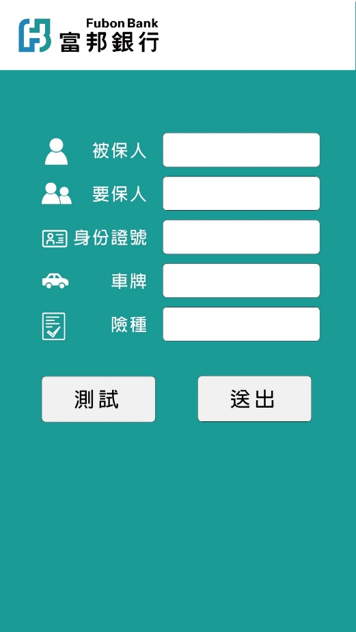

# Accident insurance reocorder app
---
## Introduction
It's an app that collaborate with department of finance. This goal is to fasten the settlement time of insurance claim on car accident. Basically, when a car accident happened, it helps u take pictures or videos, and fill those forms. Tell u how to get through insurance progress.
(It's made in 2017/06)

## Preview

## Further Details
For more details, please read this powerpoint file that we made in the course.
[PPT](富邦產險行車助手.pptx)
